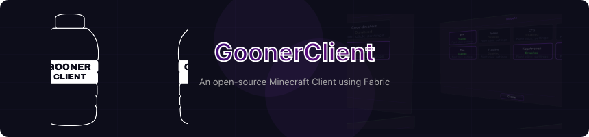

<div align="center">
  
</div>

<div align="center">

[](https://github.com/DippyCoder/GoonerClient/releases)⠀
[](https://github.com/DippyCoder/GoonerClient)
[](https://discord.gg/xe5BPEd6JA)
[](LICENSE)

**GoonerClient** is a client-only Minecraft mod (a custom client) with toggleable widgets controllable in a widget menu, using no depencies other than Fabric API.

</div>

---

## ✨ Features

-  **Custom Nightly UI** — pixel-styled GUI in a dark / purple theme
-  **Widget System** — modular, draggable HUD widgets with per-widget settings, toggling and position saving
-  **CPS Widget** - Tracks your left and right clicks per second
-  **FPS Widget** - Shows your current frames per second
-  **Coordinates Widget** - Displays your current X, Y, Z position in the world
-  **Keystrokes Widget** - Displays your WASD keys and optionally jump, sprint and sneak
-  **Playtime Widget** - Tracks how long you have been playing this session
-  **Reach Widget** - Shows the distance to the last entity you hit
-  **Speed Widget** - Shows your current movement speed in blocks per second
-  **Time Widget** - Shows your current system time

---

## 📦 Building

Make sure you have **Java 21** and **Gradle** installed.

```bash
git clone https://github.com/DippyCoder/GoonerClient.git
cd GoonerClient
./gradlew build
```

The compiled `.jar` will be in `build/libs/`. Drop it into your Fabric mods folder.

**Requirements:**
- Minecraft `1.21.11`
- Fabric Loader `≥ 0.16`
- Fabric API

---

## 🚀 Installation

1. Install [Fabric Loader](https://fabricmc.net/use/installer/)
2. Download [Fabric API](https://modrinth.com/mod/fabric-api)
3. Download the latest GoonerClient release from [Releases](https://github.com/DippyCoder/GoonerClient/releases)
4. Drop both `.jar` files into your `.minecraft/mods` folder
5. Launch Minecraft with the Fabric profile

---

## 🎮 Usage

| Keybind | Action |
|---|---|
| `Right Shift` | Open / close the GoonerClient menu |
| `Left Click` widget card | Toggle widget on / off |
| `Right Click` widget card | Open widget settings |
| Drag widget | Reposition on HUD |

---

## 📫 Contact

- Discord: [discord.gg/xe5BPEd6JA](https://discord.gg/xe5BPEd6JA)
- Issues: [GitHub Issues](https://github.com/DippyCoder/GoonerClient/issues)

---

## ⚖️ License

GoonerClient is licensed under the **GNU General Public License v3.0**.
See [LICENSE](LICENSE) for full details.